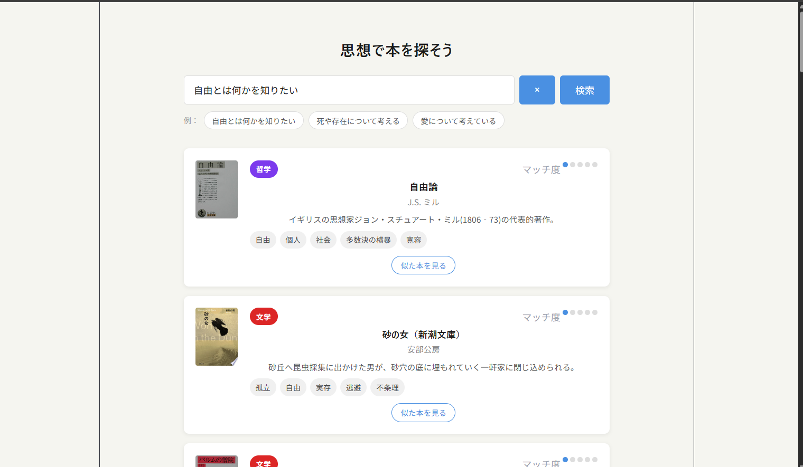

# Library - 思想で本を探すWebサービス

読書の中で「ざっくりとしたテーマから目当ての本を探せない」という課題を感じ、抽象的なキーワードから古典名著をレコメンドするWebサービスを個人開発しました。

🔗 https://d14a6msww7i0ux.cloudfront.net

---

## スクリーンショット

---

## 機能

- 思想・キーワードを入力すると関連する本をマッチング
- マッチ度をスコアで表示
- ジャンルごとの色付きバッジ表示
- 似た本を見る機能
- 本の詳細情報を見る機能

---

## 技術構成

| 領域 | 技術 |
|---|---|
| Frontend | React / Vite |
| Backend | FastAPI / Mangum |
| Database | PostgreSQL (Amazon RDS) |
| インフラ | AWS Lambda / API Gateway / S3 / CloudFront |
| IaC | Terraform |

---

## 工夫した点

- 「自由」「存在」などの抽象的なキーワードでもマッチできるよう、類義語辞書を自作してキーワードを拡張するマッチングロジックを実装
- インフラをTerraformでコード化し、AWS構成を再現可能な状態で管理
- FastAPI + Mangum によるサーバーレス構成でバックエンドをLambda上で動作させる設計を採用
