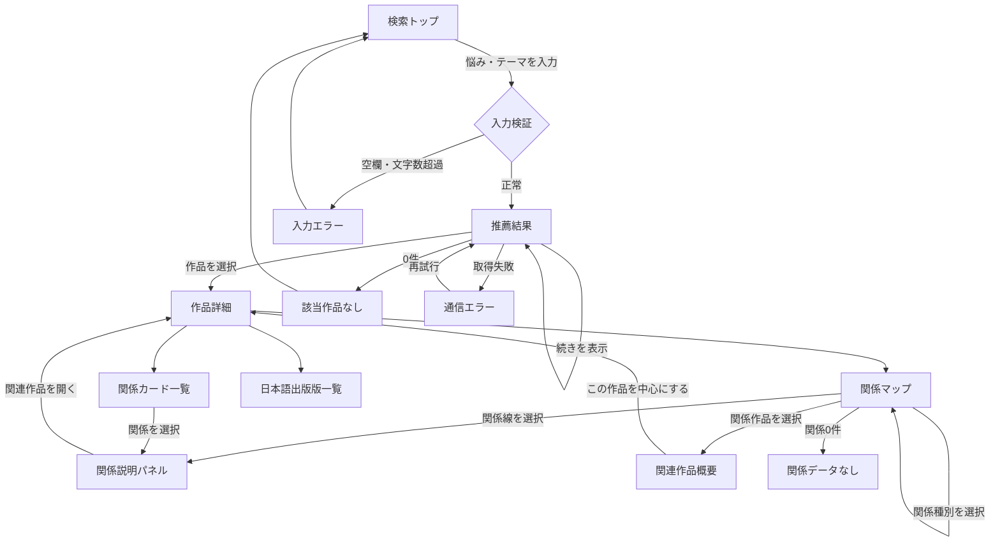
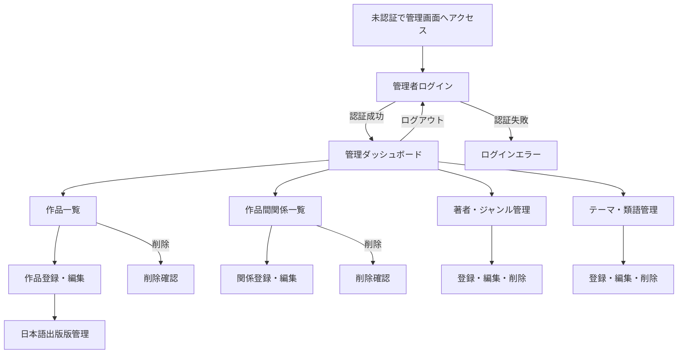
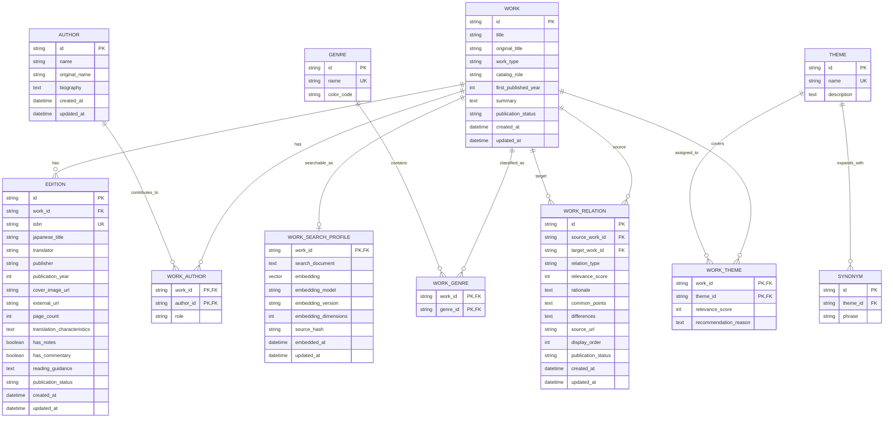

# 「思想で本を探す」（仮称）要件定義書

## 1. 概要・目的

- **課題**: 古典文学に興味を持っても、作品の難しさや数の多さから最初の一冊を選びにくい。また、一冊を読んだ後も、作品間の影響、共通テーマ、対立する考え方が分からず、次に読む作品を選びにくい。
- **解決策**: 利用者が悩みや関心を自然な文章で入力すると、ベクトル検索で意味の近い古典文学を候補として取得し、テーマ・編集優先度で再採点して理由付きで推薦する。関連する思想書・哲学書・随筆は、文学作品の問いや背景を深める補助資料として提示する。作品詳細では、作品同士の関係グラフをマップと説明文で示し、「なぜ関連するのか」を理解しながら次の作品へ進めるようにする。
- **ターゲット**: 思想・古典文学に関心はあるが専門知識がなく、何から読み始め、次に何を読めばよいか分からない大学生・若手社会人。
- **中核価値**: 単に本を推薦するのではなく、作品同士のつながりを利用者が理解し、自分の関心に沿って次の一冊を選べること。
- **MVPの成功状態**: 利用者が検索結果から興味のある作品を見つけ、作品間の関係とその根拠を確認し、次に読みたい作品を選べる。

### 用語

| 用語 | 定義 |
|---|---|
| 作品 | 原著・原作品そのもの。例：ドストエフスキーの『罪と罰』。 |
| 出版版 | 翻訳者、出版社、ISBNなどで識別される日本語の書籍。1作品に複数存在できる。 |
| 中心作品 | 検索で主に推薦する小説・戯曲・詩などの古典文学。DB上の役割は `primary`。 |
| 関連書 | 中心作品の問い・背景・影響を理解するために収録する哲学書・思想書・随筆。DB上の役割は `context`。 |
| テーマ | 孤独、自由、生きる意味など、検索と推薦に利用する概念。 |
| ベクトル検索 | 利用者の入力文と作品の検索用文章をベクトル化し、単語の一致ではなく意味の近さで候補作品を取得する検索方式。 |
| 作品間関係 | 2作品間の影響、共通テーマ、対照、時代背景、推奨読書順を表す編集データ。 |
| 関係グラフ | 作品をノード、作品間関係をエッジとして管理し、推薦後の理解と次作品の探索に利用するデータ構造。 |
| 関係マップ | 関係グラフを利用者向けに可視化する探索UI。 |

## 2. 機能スコープ

### Must（MVPで絶対作る）

#### 一般利用者向け

- ログインせずに利用できる。
- 悩み・関心・思想テーマを1〜200文字の自然文で入力できる。
- 入力文をベクトル化し、作品の検索用文章との意味的類似度から候補作品を取得できる。
- ベクトル検索で取得した候補を、テーマ一致度と編集優先度で再採点できる。
- 入力文に作品の登録キーワードが直接含まれなくても、意味が近ければ候補として取得できる。
- 推薦結果には作品名、著者、主要テーマ、マッチ度、推薦理由、一致したテーマを表示する。
- 推薦結果は「あなたに合いそうな文学作品」と「作品の問いを深める本」を区別して表示する。
- 「作品の問いを深める本」は、表示中の文学作品と公開済みの関係を持つ関連書から最大3件を表示する。
- 推薦結果を安定した順位で10件ずつ表示し、カーソル方式で続きを読み込める。
- 作品詳細に概要、初出年、著者、テーマ、日本語出版版を表示する。
- 日本語出版版には、ページ数、翻訳の特徴、注釈・解説の有無、読み進める際のヒントを表示する。
- 作品詳細に、その作品を中心とする関係マップを表示する。
- 作品間関係を「影響」「共通テーマ」「対照」「同時代・時代背景」「次に読む」の5種類で表示する。
- 関係を選択すると、関係の根拠、共通点、相違点、任意の出典URLを確認できる。
- 関連作品を選択し、その作品を中心とするマップへ移動できる。
- 関係種別でマップを絞り込める。
- マップと同じ情報を、キーボード操作可能な関係カード一覧でも確認できる。
- 入力不備、該当作品なし、通信失敗、関係データなしを区別して案内する。

#### 管理者向け

- 単一の管理者アカウントでログイン・ログアウトできる。
- 未認証の利用者は管理画面と管理APIを利用できない。
- 作品、出版版、著者、ジャンル、テーマ、類語を登録・閲覧・編集・削除できる。
- 作品の種別と、カタログ内での役割を登録・編集できる。
- 作品の検索用文章を確認・編集し、埋め込みベクトルを生成・再生成できる。
- 作品間関係と説明情報を登録・閲覧・編集・削除できる。
- 作品、出版版、作品間関係の公開・非公開を切り替えられる。
- 削除前に対象と影響範囲を確認できる。
- 外部書誌APIを採用しない場合や取得に失敗した場合も、出版版を手入力できる。

#### データ・運用

- 作品と日本語出版版を別のデータとして管理する。
- 古典文学を中心作品として扱い、文学作品と明確な関係を説明できる哲学書・思想書・随筆を関連書として追加できる。
- 作品ごとに検索用文章、埋め込みベクトル、埋め込みモデル情報、生成元ハッシュ、生成日時を管理する。
- 作品間関係は管理者が編集・確認した情報だけを公開する。
- 非公開の作品、出版版、作品間関係を一般利用者向けAPIから返さない。
- 初期カタログは固定冊数ではなく、主要テーマと次に読む導線が一通り成立していることを公開条件とする。
- MVPの候補取得はベクトル検索、順位調整はテーマ・編集優先度による再採点、推薦後の理解と探索は関係グラフで行う。
- 作品や出版版の読みにくさを理由に推薦順位を下げない。読み進めるための情報は出版版の補助情報として提示する。
- 関連書は少なくとも1つの公開中の中心作品と作品間関係を持たなければ公開できない。
- 埋め込みモデルを変更しても公開インターフェースを変えずに再生成できる構造とする。

### Won't（今回は作らない）

- 一般利用者の会員登録・ログイン
- お気に入り、読書履歴、レビュー、コメント
- 利用者による作品・関係性の投稿や編集
- 書名・著者名を中心とした一般検索
- 利用者からの本追加リクエスト
- 購入、決済、貸出、図書館在庫確認
- 生成AIによるリアルタイム推薦や関係説明の自動生成
- 公開検索時に外部書籍APIへリアルタイム問い合わせする処理
- 複数管理者、管理者の権限分け、監査ログ
- 多言語対応

## 3. 画面遷移図

### 一般利用者向け

### 管理者向け

## 4. ER図（データ設計）

### データ制約

- 公開作品は有効な `WORK_SEARCH_PROFILE` を1件持つ。下書き作品では未生成を許可する。
- `WORK.work_type` は `literature`、`philosophy`、`thought`、`essay` のいずれかとする。
- `WORK.catalog_role` は `primary` または `context` とする。
- `primary` は小説・戯曲・詩などの `literature` に使用する。`context` は文学作品の理解を補助する `philosophy`、`thought`、`essay` に使用する。
- `context` の作品を公開するには、少なくとも1件の公開中の `primary` 作品との公開済み `WORK_RELATION` を必要とする。
- `search_document` は作品概要、作品が扱う問い、想定される読者の悩み、テーマ、推薦理由から生成する。
- `source_hash` は `search_document` の変更検出に使用し、内容が変わった場合は公開検索へ反映する前にベクトルを再生成する。
- 異なる埋め込みモデルまたは異なる次元数のベクトルを、同じ検索インデックスで混在させない。
- 埋め込みベクトルそのものは一般利用者向けAPIへ返さない。
- `WORK_THEME.relevance_score` と `WORK_RELATION.relevance_score` は1〜5とする。
- `relation_type` は `influence`、`shared_theme`、`contrast`、`historical_context`、`next_read` のいずれかとする。
- `influence` と `next_read` は有向関係とし、画面上でも方向を示す。
- `shared_theme`、`contrast`、`historical_context` は双方向関係とし、同じ2作品・同じ種別の関係を1件だけ保存する。
- 作品から同じ作品への自己関係を禁止する。
- 同一ISBNの出版版を重複登録できない。
- `EDITION.page_count` は不明な場合を除き0より大きい整数とする。
- `translation_characteristics` と `reading_guidance` は難易度を数値評価せず、版ごとの特徴と読み進め方を具体的に記述する。
- `rationale`、`common_points`、`differences` は公開関係の必須項目とする。
- `source_url` は任意項目とする。ただし、影響関係では可能な限り登録する運用とする。
- 使用中の著者、ジャンル、テーマを削除する場合は、関連解除または削除中止を管理者に選ばせる。

## 5. 主要機能の受け入れ条件

一操作につき、正常系と異常系をそれぞれ1件定義する。

### 機能: 検索入力

#### 正常系

- **Given:** 利用者が検索トップを開いている。
- **When:** 利用者が1〜200文字の悩み・テーマを入力して検索する。
- **Then:** 入力文を検索APIへ送信し、推薦結果の読み込み状態を表示する。

#### 異常系

- **Given:** 利用者が検索トップを開いている。
- **When:** 空白だけ、または200文字を超える文章で検索する。
- **Then:** APIを呼び出さず、入力欄の近くに修正方法が分かるエラーを表示する。

### 機能: ベクトル検索による推薦

#### 正常系

- **Given:** 公開作品に検索用文章と有効な埋め込みベクトルが登録されている。
- **When:** 利用者の入力文をベクトル化して推薦検索を実行する。
- **Then:** 直接一致する単語がなくても意味の近い候補を取得し、再採点後の上位最大10件を推薦理由と一致テーマ付きで表示する。

#### 異常系

- **Given:** 利用者が有効な文章で推薦検索を実行している。
- **When:** 入力文のベクトル化またはベクトル検索に失敗する。
- **Then:** 根拠のない代替結果を返さず、再試行できる検索エラーを表示する。

### 機能: 推薦結果の追加読み込み

#### 正常系

- **Given:** 推薦結果が10件表示され、次ページカーソルが存在する。
- **When:** 利用者が「続きを表示」を選択する。
- **Then:** 現在の結果を保持したまま、重複のない次の最大10件が末尾に追加される。

#### 異常系

- **Given:** 推薦結果が表示されている。
- **When:** 無効または期限切れのカーソルで追加読み込みに失敗する。
- **Then:** 既存結果を保持し、再試行できるエラーを表示する。

### 機能: 作品詳細の閲覧

#### 正常系

- **Given:** 公開中の作品が推薦結果に表示されている。
- **When:** 利用者が作品を選択する。
- **Then:** 作品概要、著者、テーマ、公開中の日本語出版版と、版ごとの読み進めるための情報が表示される。

#### 異常系

- **Given:** 対象作品が存在しない、または非公開になっている。
- **When:** 利用者がその作品のURLを開く。
- **Then:** 作品情報を表示せず、404相当の案内と検索トップへの導線を表示する。

### 機能: 関連書の表示

#### 正常系

- **Given:** 推薦結果の文学作品に、公開中の思想書・哲学書・随筆が関係付けられている。
- **When:** 利用者が推薦結果を表示する。
- **Then:** 文学作品とは別の「作品の問いを深める本」枠に、関係理由付きで関連書を最大3件表示する。

#### 異常系

- **Given:** 推薦結果の文学作品に公開可能な関連書がない。
- **When:** 利用者が推薦結果を表示する。
- **Then:** 空の関連書枠を表示せず、文学作品の推薦結果だけを表示する。

### 機能: 関係マップの表示

#### 正常系

- **Given:** 対象作品に公開中の作品間関係が登録されている。
- **When:** 利用者が作品詳細の関係マップを開く。
- **Then:** 対象作品を中央に、関連度と表示順で選ばれた一次関係を最大12作品まで表示する。

#### 異常系

- **Given:** 対象作品に公開中の作品間関係がない。
- **When:** 利用者が関係マップを開く。
- **Then:** 空のグラフを表示せず、関係データが未登録であることと検索へ戻る導線を表示する。

### 機能: 関係説明の閲覧

#### 正常系

- **Given:** 関係マップに作品間の線が表示されている。
- **When:** 利用者が関係線または関係カードを選択する。
- **Then:** 関係種別、方向、根拠、共通点、相違点、登録されている場合は出典リンクを表示する。

#### 異常系

- **Given:** 表示後に対象関係が非公開または削除された。
- **When:** 利用者がその関係を選択する。
- **Then:** 非公開データを表示せず、関係情報を更新するよう案内する。

### 機能: 関係種別による絞り込み

#### 正常系

- **Given:** 複数種別の関係がマップに表示されている。
- **When:** 利用者が1つ以上の関係種別を選択する。
- **Then:** 選択した種別のノードとエッジだけを、凡例とともに表示する。

#### 異常系

- **Given:** 選択した種別に該当する関係がない。
- **When:** 利用者がその種別で絞り込む。
- **Then:** マップ操作を維持しながら、該当関係がないことを表示する。

### 機能: 関連作品を中心とした再探索

#### 正常系

- **Given:** 関係マップ上で関連作品が選択されている。
- **When:** 利用者が「この作品を中心にする」を選択する。
- **Then:** 選択作品の詳細と、その作品を中心にした関係マップへ更新される。

#### 異常系

- **Given:** 現在の関係マップが正常に表示されている。
- **When:** 関連作品の取得に失敗する。
- **Then:** 現在のマップを保持し、再試行できるエラーを表示する。

### 機能: 関係カード一覧の操作

#### 正常系

- **Given:** 対象作品に公開中の作品間関係がある。
- **When:** 利用者がキーボードで関係カードを選択する。
- **Then:** マップと同じ関係説明を閲覧し、関連作品へ移動できる。

#### 異常系

- **Given:** 一部の任意データに欠損がある。
- **When:** 利用者が関係カード一覧を表示する。
- **Then:** 欠損項目を省略し、必須の根拠・共通点・相違点と操作導線は維持する。

### 機能: 管理者ログイン

#### 正常系

- **Given:** 管理者がログイン画面を開いている。
- **When:** 正しい管理者名とパスワードを入力する。
- **Then:** 認証済みセッションを発行し、管理ダッシュボードへ移動する。

#### 異常系

- **Given:** 管理者がログイン画面を開いている。
- **When:** 誤った認証情報を入力する。
- **Then:** 管理者名とパスワードのどちらが誤りかを明かさず、共通エラーを表示する。

### 機能: 作品の作成

#### 正常系

- **Given:** 管理者が認証済みで作品登録画面を開いている。
- **When:** 必須項目を入力して保存する。
- **Then:** 作品を保存し、非公開状態の作品詳細または編集画面を表示する。

#### 異常系

- **Given:** 同一と判断できる作品がすでに登録されている。
- **When:** 管理者が重複作品を保存する。
- **Then:** 保存せず、既存作品を確認できる重複エラーを表示する。

### 機能: 出版版の作成

#### 正常系

- **Given:** 管理者が対象作品の編集画面を開いている。
- **When:** 有効なISBNと必須書誌情報を入力して保存する。
- **Then:** 出版版を対象作品へ関連付け、非公開状態で保存する。

#### 異常系

- **Given:** 入力されたISBNが別の出版版で使用されている。
- **When:** 管理者が保存する。
- **Then:** 重複する出版版を案内し、新規保存しない。

### 機能: 作品間関係の作成

#### 正常系

- **Given:** 管理者が認証済みで、異なる2作品が登録されている。
- **When:** 関係種別、関連度、根拠、共通点、相違点を入力して保存する。
- **Then:** 関係を非公開状態で保存し、方向とマップ上のプレビューを表示する。

#### 異常系

- **Given:** 同じ作品同士、または同じ2作品・同じ種別の関係が登録済みである。
- **When:** 管理者が関係を保存する。
- **Then:** 自己参照または重複を示し、保存しない。

### 機能: 作品間関係の編集

#### 正常系

- **Given:** 管理者が既存の作品間関係を開いている。
- **When:** 説明、関連度、表示順または公開状態を変更して保存する。
- **Then:** 更新内容を保存し、公開中なら一般向けマップへ反映する。

#### 異常系

- **Given:** 編集中に対象関係が削除されている。
- **When:** 管理者が変更を保存する。
- **Then:** 新規作成せず、対象が存在しないことを表示する。

### 機能: 作品間関係の削除

#### 正常系

- **Given:** 管理者が既存の作品間関係を選択している。
- **When:** 削除確認で対象2作品と関係種別を確認し、削除を確定する。
- **Then:** 関係を削除し、一覧と公開マップから除外する。

#### 異常系

- **Given:** 削除対象が表示されている。
- **When:** 削除APIが失敗する。
- **Then:** 一覧から対象を消さず、再試行できるエラーを表示する。

### 機能: 未認証の管理画面アクセス

#### 正常系

- **Given:** 管理者セッションが有効である。
- **When:** 管理画面または管理APIへアクセスする。
- **Then:** 要求した画面またはデータを利用できる。

#### 異常系

- **Given:** 管理者セッションが存在しない、または期限切れである。
- **When:** 管理画面または管理APIへアクセスする。
- **Then:** 管理APIは401相当を返し、画面はログインへ移動する。

## 6. 技術スタック & 外部サービス

具体的な製品は技術設計工程で決定する。既存構成は参考にできるが、本要件では固定しない。

- **Frontend**: SPA。関係マップはSVGまたはCanvasで描画し、同じ情報をセマンティックなHTML一覧でも提供する。
- **Backend/DB**: REST APIと、ベクトル類似度検索および作品間関係の参照に対応できる永続データベース。作品検索、関係グラフ取得、管理者認証、CRUDを提供する。
- **推薦方式**: 入力文と作品検索用文章のベクトル類似度で候補30件を取得し、意味的類似度70%、テーマ一致度20%、編集優先度10%を初期配分として再採点する。作品や出版版の読みにくさは順位へ使用しない。配分は評価用検索データによる検証後に調整できる設定値とする。
- **カタログ方針**: 通常の推薦候補は `primary` の古典文学とする。`context` の思想書・哲学書・随筆は、推薦された文学作品との公開済み関係を根拠に別枠で提示する。
- **関係探索方式**: 推薦作品を起点に `WORK_RELATION` の一次関係を取得し、関連度と表示順で最大12作品を表示する。関係説明は管理者が確認した保存データを使用する。
- **外部API**: 初期作品と日本語出版版の選定後に、必要な書誌項目と利用条件を基準に選定する。候補はopenBD、NDL Search、Google Books。MVP公開時に未選定でも手入力で運用できる。
- **Hosting**: HTTPS、CDN、SPA配信、API実行環境、永続DB、秘密情報管理を提供できるクラウド環境。
- **参考構成**: React/Vite、FastAPI、PostgreSQLとベクトル検索拡張、マネージドAPI実行環境、オブジェクトストレージ、CDN、Terraform。既存AWS構成を継続する場合も、ベクトル検索に対応するDBまたは検索基盤を追加する。

### 推薦処理フロー

1. 利用者の入力文を、作品データと同じ埋め込みモデル・バージョンでベクトル化する。
2. 公開中かつ `primary` の作品の `WORK_SEARCH_PROFILE` からコサイン類似度上位30件を候補として取得する。
3. 候補を意味的類似度、テーマ一致度、編集優先度で再採点する。
4. 安定した同点時順位を適用し、10件単位で返す。
5. 表示する文学作品と公開済み関係を持つ `context` の関連書を取得し、関連度と表示順で最大3件を別枠に返す。
6. 作品詳細では `WORK_RELATION` から一次関係を取得し、根拠・共通点・相違点とともに表示する。
7. ベクトル類似度だけから関係説明を生成せず、公開済みのテーマ・作品間関係を推薦理由に使用する。

### 論理API

| 種別 | 操作 | 入出力の要点 |
|---|---|---|
| 公開 | 推薦検索 | 検索文、件数、カーソルを受け取り、中心となる文学作品、推薦根拠、各スコア、次カーソル、関連書最大3件を区分して返す。埋め込みベクトルは返さない。 |
| 公開 | 作品詳細取得 | 作品、著者、テーマ、公開中の出版版を返す。 |
| 公開 | 関係グラフ取得 | 中心作品と関係種別を受け取り、最大13ノードとエッジ説明を返す。 |
| 管理 | セッション作成・削除 | 管理者認証とログアウトを行う。 |
| 管理 | マスターデータCRUD | 作品、出版版、著者、ジャンル、テーマ、類語を管理する。 |
| 管理 | 検索プロファイル生成 | 作品の検索用文章を確認し、埋め込みベクトルを生成・再生成する。 |
| 管理 | 作品間関係CRUD | 関係種別、方向、根拠、共通点、相違点、関連度、表示順を管理する。 |

## 7. デザイン・UI方針

- 古典文学の難しさを和らげる、落ち着いた読書体験にする。
- 専門用語を前提にせず、推薦理由、作品間関係、版ごとの読み進め方を平易な日本語で説明する。
- 関係マップは情報の装飾ではなく、次の作品を選ぶための主要操作として扱う。
- 文学作品には「文学作品」、哲学書・思想書・随筆には対応する種別ラベルを表示する。
- 関係マップでは中心作品と関連書をノードの形とテキストラベルで区別し、色だけに依存しない。
- 関係種別は色、線種、アイコン、テキストラベルを併用し、色だけで区別しない。
- 有向関係は矢印と説明文で方向を示す。
- ノードや線を選択したとき、選択状態とフォーカス位置を明確にする。
- PCとスマートフォンの両方で主要操作を完了できるようにする。
- マップが狭い画面では、詳細パネルを画面下部へ表示する。
- すべての操作をキーボードで実行できるようにする。
- 適切なコントラスト、フォーカス表示、フォームラベル、代替テキスト、エラー通知を提供する。
- 読み込み中、空状態、通信失敗、非公開状態を視覚的に区別する。

## 8. 必要な環境変数（.env）

製品選定前の論理名として定義する。実装時にフレームワークの命名規則へ合わせてもよい。

| 変数名 | 必須 | 公開可否 | 用途 |
|---|---|---|---|
| `APP_ENV` | 必須 | 非公開 | `development`、`test`、`production` の実行環境。 |
| `PUBLIC_API_BASE_URL` | 必須 | 公開可 | フロントエンドが呼び出す公開APIの基点URL。 |
| `DATABASE_URL` | 必須 | 非公開 | 永続データベースへの接続情報。 |
| `EMBEDDING_MODEL` | 必須 | 非公開 | 作品と検索文のベクトル化に使用する埋め込みモデル名。 |
| `EMBEDDING_MODEL_VERSION` | 必須 | 非公開 | 検索インデックスと入力ベクトルの互換性を管理するモデルバージョン。 |
| `EMBEDDING_DIMENSIONS` | 必須 | 非公開 | 保存・検索する埋め込みベクトルの次元数。 |
| `EMBEDDING_API_BASE_URL` | 条件付き | 非公開 | 外部の埋め込みAPIを使用する場合の基点URL。 |
| `EMBEDDING_API_KEY` | 条件付き | 非公開 | 外部の埋め込みAPIを使用する場合の認証キー。 |
| `ADMIN_USERNAME` | 必須 | 非公開 | 単一管理者のログイン名。 |
| `ADMIN_PASSWORD_HASH` | 必須 | 非公開 | 平文ではない管理者パスワードハッシュ。 |
| `SESSION_SECRET` | 必須 | 非公開 | 管理者セッションの署名・暗号化に使用する十分に長い乱数。 |
| `ALLOWED_ORIGINS` | 必須 | 非公開 | CORSで許可するフロントエンドのオリジン一覧。 |
| `BOOK_METADATA_API_BASE_URL` | 任意 | 非公開 | 採用した外部書誌APIの基点URL。 |
| `BOOK_METADATA_API_KEY` | 任意 | 非公開 | 外部書誌APIが認証を必要とする場合のキー。 |

### 環境変数の運用条件

- `.env` の実値をGitへコミットしない。
- リポジトリには変数名と安全な例だけを記載した `.env.example` を置く。
- 本番の秘密情報はホスティング環境の秘密情報管理機能へ保存する。
- `PUBLIC_API_BASE_URL` 以外の秘密情報をフロントエンドのビルドへ埋め込まない。
- 管理者パスワードを平文で保存しない。
- 埋め込みモデル・バージョン・次元数を変更する場合は、全公開作品のベクトルを再生成してから検索インデックスを切り替える。

## 9. 初期カタログの公開条件

初期公開の可否は冊数ではなく、以下の条件で判断する。

- 主要な悩み・関心テーマそれぞれに複数の公開作品が登録されている。
- 初期カタログの中心は小説・戯曲・詩などの古典文学とする。
- 哲学書・思想書・随筆は、中心となる文学作品の問い・背景・影響を理解するうえで必要なものだけを関連書として収録する。
- 公開する関連書には、中心作品との関係理由と、根拠・共通点・相違点が登録されている。
- 公開作品には少なくとも1つの日本語出版版が登録されている。
- 公開する日本語出版版には、分かる範囲でページ数、翻訳の特徴、注釈・解説の有無、読み進める際のヒントが登録されている。
- 中核として扱う作品には、少なくとも1つの「次に読む」関係が登録されている。
- 作品間関係には、利用者が違いを理解できる根拠、共通点、相違点が登録されている。
- すべての公開作品に有効な検索用文章と、同一モデル・バージョンで生成した埋め込みベクトルが登録されている。
- ペルソナを想定した評価用自然文について、直接一致する単語がない場合も期待作品を候補上位に取得できることを確認する。
- 孤立した作品の割合を確認し、意図しない孤立作品を公開前に解消する。
- ペルソナが検索から関係理解、次の作品選択まで完了できるユーザーテストを実施する。

## 10. 確定済み前提・未決要件

### 確定済み前提

- アプリ名は正式決定まで「思想で本を探す」を仮称とする。
- 初期カタログは、日本語で読める古典文学を中心に管理者が選定する。
- 文学作品との関係を明確に説明できる思想書・哲学書・随筆は、関連書として追加できる。
- 作品や出版版の読みにくさは推薦順位に使用せず、出版版ごとの読み進め方として表示する。
- 候補取得にはベクトル検索、作品理解と次作品の探索には関係グラフを使用する。
- 作品間関係と説明は管理者が確認した情報だけを公開し、AI出力を無検証で公開しない。
- 一般利用者はログイン不要とし、MVPでは個人向け保存機能を持たない。

### 優先度の定義

| 優先度 | 意味 |
|---|---|
| P0 | 実装着手前に決定しないと、DB・API・主要実装を確定できない。 |
| P1 | MVP公開前までに決定する必要がある。 |
| P2 | MVP公開後の改善として決定してもよい。 |

### 未決要件一覧

| ID | 優先度 | 分類 | 未決事項 | 決める内容・完了条件 |
|---|---|---|---|---|
| U-01 | P2 | プロダクト | 正式なアプリ名 | サービスの中核価値と古典文学中心であることが伝わる名称、表記、ドメイン候補を決定する。 |
| U-02 | P1 | 選書 | 初期カタログの具体的な作品 | 中心作品、関連書、中核テーマの候補を採用基準で評価し、初期公開対象を確定する。固定冊数ではなく、テーマと関係グラフの網羅性で完了を判断する。 |
| U-03 | P0 | コンテンツ | 1作品あたりの必須登録情報 | 「作品が扱う問い」の必須件数、テーマ件数、概要の長さ、関連作品の最低件数、出版版情報の必須範囲を決定する。 |
| U-04 | P0 | ベクトル検索 | ベクトル化する文章単位 | 作品全体の `search_document` を1件作るか、問い・読者の悩み・得られる視点を別ベクトルとして持つかを決定する。問いを主ベクトルにする場合は、作品スコアの集約方法も決める。 |
| U-05 | P0 | ベクトル検索 | 埋め込みモデル | 日本語性能、料金、応答時間、入力データの取り扱いを比較し、モデル、バージョン、次元数、外部APIまたはローカル実行の別を決定する。 |
| U-06 | P0 | DB | ベクトル保存・検索基盤 | PostgreSQLとベクトル検索拡張へ移行するか、既存DBと専用ベクトル検索基盤を併用するかを決定する。トランザクション、バックアップ、運用費も比較する。 |
| U-07 | P0 | 検索ロジック | スコアの正規化と最終計算 | 意味的類似度70%、テーマ一致度20%、編集優先度10%を同じ尺度へ正規化する方法、最低関連度、同点時順位を決定する。 |
| U-08 | P0 | 品質評価 | 検索精度の合格基準 | 評価用自然文と期待作品の正解セットを作り、上位K件への到達率などの指標とMVP合格値を決定する。旧キーワード検索との比較も行う。 |
| U-09 | P0 | API | 公開・管理APIの具体契約 | URL、HTTPメソッド、リクエスト・レスポンスJSON、エラー形式、カーソル仕様、検索インデックス更新時のカーソル無効化方針を決定する。 |
| U-10 | P0 | 移行 | 現行DynamoDBデータの移行方法 | 既存書籍データを新しい作品・出版版・テーマ構造へ変換するマッピング、再投入、検証、切り替え、ロールバック方法を決定する。 |
| U-11 | P1 | 登録運用 | AI支援付き登録フロー | 書誌補完、問い・テーマ・関係候補の下書き生成、管理者レビュー、承認、ベクトル生成をどこまで自動化するか決定する。AI下書きは公開前レビュー必須とする。 |
| U-12 | P1 | 管理画面 | 一括登録方法 | CSVの列定義、重複判定、行単位のエラー表示、部分成功の扱い、再実行時の冪等性を決定する。 |
| U-13 | P1 | 外部サービス | 書誌・表紙情報API | 初期作品のISBNでopenBD、NDL Search、Google Books等の取得率と利用条件を比較し、採用APIと手入力へのフォールバックを決定する。 |
| U-14 | P0 | 関係グラフ | 関係情報の根拠・レビュー基準 | 「影響」は出典必須とするか、管理者解釈と事実関係をどう区別するか、レビュー状態、確認日、出典情報をどう保存するか決定する。 |
| U-15 | P1 | 関係グラフ | 関係候補の半自動生成 | ベクトル類似度と共通テーマから候補を作るか、AIに説明の下書きを作らせるか、管理者が承認・却下する操作を決定する。 |
| U-16 | P0 | プライバシー | 利用者の自然文入力の取り扱い | 検索文を保存するか、ログから除外するか、保存期間、匿名化、外部埋め込みAPIへの送信表示、分析利用の同意を決定する。MVPの推奨初期値は「原則保存しない」。 |
| U-17 | P0 | 安全性 | センシティブな入力への対応 | 自傷・自殺、医療、違法行為などを示す入力に対する案内、免責表示、推薦を通常継続する範囲を決定する。 |
| U-18 | P0 | セキュリティ | 管理者認証の詳細 | セッション有効期限、Cookie属性、CSRF対策、ログイン試行制限、パスワード更新、秘密情報ローテーションを決定する。 |
| U-19 | P0 | データ管理 | 削除・アーカイブ方針 | 作品・出版版・関係を物理削除するか、非公開・論理削除で保持するか、関連データの扱いと復元方法を決定する。推奨初期値はアーカイブ方式。 |
| U-20 | P1 | 権利 | 書誌・表紙・説明文の利用条件 | 表紙画像、書誌APIデータ、AI生成下書き、管理者作成要約の利用・保存・キャッシュ条件を確認し、出典表示と削除依頼への対応を決定する。 |
| U-21 | P1 | 非機能 | 性能・可用性目標 | 検索、作品詳細、関係マップの応答時間、同時利用数、タイムアウト、稼働率、レート制限の目標値を決定する。 |
| U-22 | P1 | 運用 | 監視・バックアップ・復旧 | APIエラー、埋め込み生成失敗、検索0件率、DB容量を監視し、バックアップ頻度、保存期間、復元試験、障害通知方法を決定する。 |
| U-23 | P1 | UI | 関係マップの実装方式 | SVGまたはCanvas、使用ライブラリ、ノード配置、モバイル表示、キーボード操作、関係一覧への切り替え方法を決定する。 |
| U-24 | P1 | アクセシビリティ | 対応基準・ブラウザ | 準拠するアクセシビリティ水準、対応ブラウザ、スマートフォン最小幅、マップを使わない代替操作の試験方法を決定する。 |
| U-25 | P2 | 分析 | 利用状況の計測 | 個人の検索文を保存せずに、検索成功率、作品詳細への遷移、関係マップ利用、次作品選択をどこまで計測するか決定する。 |

### 決定の推奨順序

1. U-03：1作品あたりの必須登録情報
2. U-04：ベクトル化する文章単位
3. U-05・U-06：埋め込みモデルと保存・検索基盤
4. U-08：評価データと合格基準
5. U-07：評価結果に基づくスコア計算
6. U-14：作品間関係の根拠・レビュー基準
7. U-09・U-10：API契約と現行データ移行
8. U-16〜U-22：公開前の安全性・セキュリティ・運用要件

未決事項を決定した場合は、この一覧から削除するだけでなく、該当する機能、ER図、受け入れ条件、技術要件へ決定内容を反映する。
